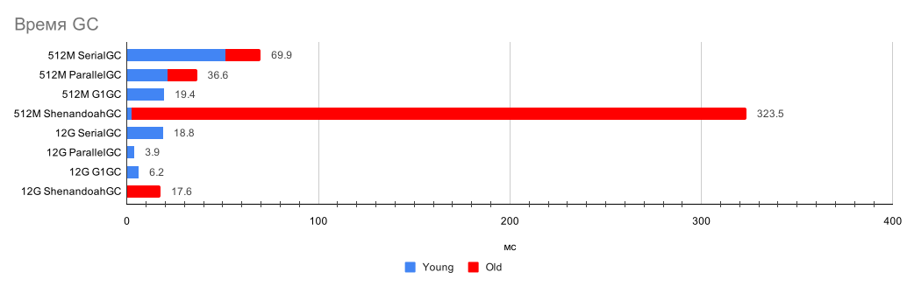
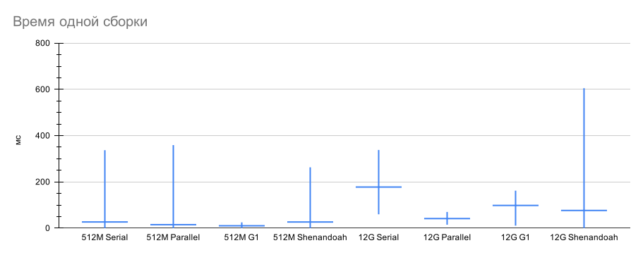

# Сравнение разных сборщиков мусора

В качестве задачи взята десериализация большого количества однотипных JSON объектов и
заполнение ими большого массива. В приложение добавлена утечка памяти так, что примерно
через 5 минут работы оно падает с `OutOfMemoryException`. Тест настроен так, чтобы он 
завершался примерно через 3 минуты, т. е. до исчерпания всей памяти. Сравним работу приложения 
при использовании сборщиков мусора **SerialGC**, **ParallelGC**, **G1GC**, 
**ShenandoahGC** с химпом *512MiB* и *12GiB*.

## Таблица измерений

|                        | Общее время, с | Сборок в минуту      | Время GC в минуту, с | Young сборок | Young время, с | Young  мин, мс  | Young срдн, мс | Young макс, мс  | Old сборок | Old время, с | Old  мин, мс  | Old срдн, мс | Old макс, мс |
| ---------------------: | -------------: | -------------------: | -------------------: | -----------: | -------------: | --------------: | -------------: | --------------: | ---------: | -----------: | ------------: | -----------: | -----------: |
| SerialGC&nbsp;512M     |            199 |               786.70 |                21.04 |         2528 |          51.36 |               0 |          20.31 |              47 |         84 |       18.496 |           115 |       220.19 |          334 |
| ParallelGC&nbsp;512M   |            156 |               933.18 |                14.05 |         2354 |          21.02 |               3 |           8.93 |              47 |         76 |       15.553 |            26 |        204.6 |          356 |
| G1GC&nbsp;512M         |            149 |               756.65 |                 7.80 |         1883 |          19.41 |               1 |          10.31 |              22 |          0 |            0 |             0 |            0 |            0 |
| ShenandoahGC&nbsp;512M |            371 |              1966.16 |                52.35 |         9719 |           2.58 |               0 |           0.27 |               3 |       2429 |       320.88 |            22 |        132.1 |          260 |
| SerialGC&nbsp;12G      |            140 |                45.36 |                 8.06 |          106 |          18.84 |              63 |         177.74 |             335 |          0 |            0 |             0 |            0 |            0 |     
| ParallelGC&nbsp;12G    |            126 |                45.35 |                 1.88 |           95 |           3.94 |              18 |          41.45 |              67 |          0 |            0 |             0 |            0 |            0 |
| G1GC&nbsp;12G          |            136 |                27.83 |                 2.73 |           63 |           6.19 |              14 |          98.19 |             159 |          0 |            0 |             0 |            0 |            0 |
| ShenandoahGC&nbsp;12G  |            147 |                94.03 |                 7.19 |          184 |           0.07 |               0 |           0.35 |               1 |         46 |       17.515 |           122 |       380.76 |          602 |

## SerialGC

С 512&nbsp;МБ хипом тест был выполнен за 199 секунд. Всего было 2528 сборок GC типа Copy (Pause
Young) в среднем по 20.31 мс каждая (0 - 47 мс) и 84 GC сборки MarkSweepCompact (
Pause Full) 115 - 334 мс. На GC ушло 35% всего времени.  
По мере исчерпания свободной памяти из-за утечки, уменьшалось количество выполняемых
быстрых young сборок и увеличивалось количество долгих full сборок. Если
продолжить тестирование, то со временем время GC увеличивается до 99% от всего времени.

С хипом 12&nbsp;ГБ тест был пройден за 140 секунд, было выполнено 106 young сборок GC в
среднем по 178 мс (63 - 335 мс). Full сборки при этом не запускались. 13.438% - время GC с
хипом 12&nbsp;ГБ.

512MБ: [консоль](data/log/gc-SerialGC-512M.log), [подробный лог](data/log/gc-SerialGC-512M-verbose.log)  
&nbsp;&nbsp;&nbsp;12ГБ: [консоль](data/log/gc-SerialGC-12G.log), [подробный лог](data/log/gc-SerialGC-12G-verbose.log)

## ParallelGC

При 512&nbsp;МБ, для выполнения теста понадобилось 156 секунд. Было выполнено 2354 быстрых
сборки GC Scavenge (Pause Young) в среднем по 8.93 мс (3 - 47 мс) и 76 сборок MarkSweep 
(Pause Full) от 26 до 356 мс. На GC ушло 23.411% времени.

Young сборки выполняются в 2.5 - 4 раза быстрее, чем у SerialGC, при этом среднее время
Full сборок отличается незначительно.  

Так же, как и с SerialGC, по мере исчерпания памяти, уменьшается количество young-сборок и
увеличивается количество full.

С хипом 12&nbsp;ГБ тест был пройден за 126 секунд, вызвано 95 сборок young в среднем по 41.45 мс
(18 - 67 мс), без вызовов Full GC. 3.133% - время GC с хипом 12&nbsp;ГБ. Если продолжить
тестирование, то появляются Full GC сборки длительностью от 1 до 10 секунд.      

512&nbsp;МБ: [консоль](data/log/gc-ParallelGC-512M.log), [подробный лог](data/log/gc-ParallelGC-512M-verbose.log)  
&nbsp;&nbsp;&nbsp;12&nbsp;ГБ: [консоль](data/log/gc-ParallelGC-12G.log), [подробный лог](data/log/gc-ParallelGC-12G-verbose.log)

## G1GC

С хипом 512 МБ данный сборщик мусора показал лучший результат, выполнив тест за 149 секунд.
1883 раза была вызвана сборка Young Generation, в среднем по 10.31 мс. (1 — 22 мс.),
Вызовы Old Generation не выполнялись. Паузы G1GC сопоставимы с паузами у young — сборок
ParallelGC, но на том же объеме работы сборщику ParallelGC понадобились ещё долгие вызовы
Full GC. 12.999% - время GC.  

Если увеличить объем работ и продолжить тестирование, то из-за исчерпания свободной памяти
по причине утечки, начинают вызываться old generation сборки от 200 до 430 мс.  

С хипом 12&nbsp;ГБ тест был выполнен за 136 секунд (что чуть медленнее, чем c ParallelGC),
было выполнено 63 сборки Young generation в среднем по 98.19 мс (14 — 159 мс). При
продолжении тестирования появляются old generation сборки в среднем по 1.6
секунды и в пиках до 3.3 секунд.

512&nbsp;МБ: [консоль](data/log/gc-G1GC-512M.log), [подробный лог](data/log/gc-G1GC-512M-verbose.log)  
&nbsp;&nbsp;&nbsp;12&nbsp;ГБ: [консоль](data/log/gc-G1GC-12G.log), [подробный лог](data/log/gc-G1GC-12G-verbose.log)

## ShenandoahGC

ShenandoahGC показал худший результат как на 512&nbsp;МБ хипе, так и на 12&nbsp;ГБ.
На 512&nbsp;МБ хипе GC занял 87.3% времени, было вызвано 2429 долгих сборок (Shenandoah Cycles)
в среднем по 132.10 мс (22 - 260 мс) мс и 9719 коротких (Shenandoah Pauses) 0.27 мс.
Тест занял 371 секунду.  

С хипом 4&nbsp;ГБ было гораздо меньше Shenandoah Cycles (46 сборок в среднем 380.76 мс),
но тест выполнялся дольше, чем с другими GC - 147 секунд, и максимальные паузы доходили до 600 мс.

512&nbsp;МБ: [консоль](data/log/gc-ShenandoahGC-512M.log), [подробный лог](data/log/gc-ShenandoahGC-512M-verbose.log)  
&nbsp;&nbsp;&nbsp;12&nbsp;ГБ: [консоль](data/log/gc-ShenandoahGC-12G.log), [подробный лог](data/log/gc-ShenandoahGC-12G-verbose.log)

## Выводы

Лучший сборщик мусора для данной задачи - G1GC. Его производительность сравнима с
производительностью других, самых быстрых сборщиков мусора, но при этом он имеет ещё и
стабильно короткие паузы GC и предсказуемое поведение при исчерпании свободной памяти.